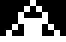
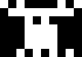

# Bug_Storm

**Bug_Storm** is a monochrome 1-bit arcade shooter developed for the **AK Embedded Base Kit** using the STM32L151CBT6 microcontroller and a 128 x 64 OLED display.

The player controls a spacecraft that fires automatically, destroys formations of flying Bugs and collects square Gifts to increase firepower from one to four shots. After every formation is cleared, a Boss appears with its own health bar, movement pattern and attacks.

The game includes progressive wave difficulty, three Player lives, scoring, a high-score record, sound effects and a compact interface designed for three physical buttons.

## Game Objects

| Bitmap | Object | Description |
|:---:|---|---|
|  | **Player Ship** | Moves horizontally, fires automatically and starts with three lives. |
|  | **Bullet** | Travels upward and damages Bugs or the Boss. |
|  | **Bug** | Flies in formation, moves toward the Player and awards points when destroyed. |
|  | **Egg** | Falls from Bugs or the Boss and removes one Player life on impact. |
|  | **Gift** | Increases firepower from one to a maximum of four simultaneous shots. |
|  | **Boss** | Appears after each formation is cleared and must be defeated to advance. |

## Video Demo

  <video
    src="https://github.com/user-attachments/assets/cace2061-e597-41b6-9cb5-8d4b5ea76f48"
    controls
    width="800"
    style="max-width: 100%; transform: rotate(180deg);">
  </video>

