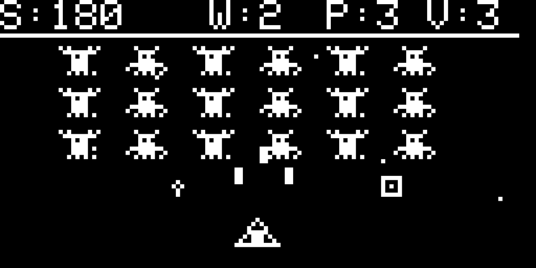

<div align="center">


# Bug_Storm

**A 1-bit vertical arcade shooter for the AK Embedded Base Kit STM32L151**

Bug_Storm demonstrates event-driven embedded game design with automatic shooting, animated Bug formations, power-up Gifts, Boss fights, bitmap-style rendering and timer-driven gameplay.

</div>

<p align="center">
  
</p>

<p align="center"><em>Gameplay, high-score and menu panels use actual firmware framebuffers. Only the Board panel remains a placeholder for a future photograph.</em></p>

## Table of Contents

| No. | Section | Description |
|---:|---|---|
| 1 | [Hardware](#i-hardware) | Target board, MCU specifications and flash layout |
| 2 | [Introduction](#introduction) | Game overview and project purpose |
| 3 | [Demo](#demo) | Gameplay demo video |
| 4 | [Main Features](#main-features) | Core firmware and gameplay features |
| 5 | [How to Play](#how-to-play) | Controls, scoring, power-ups, Boss and restart behavior |
| 6 | [Game Objects](#game-objects) | Code-derived previews, dimensions and behavior |
| 7 | [Gameplay Interface](#gameplay-interface) | Real 128 x 64 framebuffer exported by the firmware |
| 8 | [Basic Game Sequence Logic](#iv-basic-game-sequence-logic) | Time-ordered input, tick, collision, Boss and Game Over flow |
| 9 | [Build and Flash](#build-and-flash) | Linux build commands, output file and flash addresses |
| 10 | [Project Structure](#project-structure) | Main repository folders |
| 11 | [Documentation](#documentation) | Detailed design and development guides |

## I. Hardware

<p align="center">
  
</p>

<p align="center"><b>Figure 1:</b> AK Embedded Base Kit</p>

The **AK Embedded Base Kit** provides a 128 x 64 monochrome OLED, three push buttons and a buzzer. Bug_Storm uses the buttons for horizontal movement and game control, the OLED for the complete 1-bit game frame, and the buzzer for gameplay feedback.

### Specifications

| Item | Value |
|---|---|
| MCU | STM32L151CBT6 |
| CPU | Arm Cortex-M3 |
| RAM | 16 KB |
| Flash | 128 KB |
| Display | 128 x 64 monochrome OLED |
| Input | SW2, SW3 and SW4 |
| Audio | On-board buzzer |

### Flash Partition Layout

| Memory Range | Size | Partition | Description |
|---|---:|---|---|
| `0x08000000 - 0x08001FFF` | 8 KB | Bootloader | AK bootloader partition |
| `0x08002000 - 0x08002FFF` | 4 KB | BSF Shared | Data shared between bootloader and application |
| `0x08003000 - 0x0801FFFF` | 116 KB | Application | Bug_Storm firmware |

## Introduction

**Bug_Storm** is a vertical arcade shooter developed for the AK event-driven firmware architecture. The Player Ship moves horizontally near the bottom of the screen and fires upward automatically. Each wave begins with a formation of 18 animated Bugs arranged in six columns and three rows.

Bugs release falling Eggs that damage the Player. Destroyed Bugs can drop square Gifts that increase the number of simultaneous shots from one to a maximum of four. Clearing a formation starts a Boss fight with a wave-scaled health bar. Defeating the Boss advances the game to the next, more difficult wave.

## Demo

<div align="center">
  <video
    src="https://github.com/user-attachments/assets/cace2061-e597-41b6-9cb5-8d4b5ea76f48"
    controls
    width="700"
    style="max-width: 100%; transform: rotate(180deg);">
  </video>
</div>

## Main Features

- Event-driven screen flow using AK messages and software timers.
- A 100 ms periodic game tick with update-before-render behavior.
- Pixel-accurate 1-bit rendering on a 128 x 64 OLED.
- Automatic Player shooting with four power levels.
- An 18-Bug animated formation with wave-dependent movement speed.
- Random Egg attacks and square Gift drops.
- Boss battle after every cleared formation.
- Boss health scaling using `10 + wave * 5` HP.
- Three Player lives, temporary invulnerability, score and high-score tracking.
- Wave progression, sound effects, Game Over, restart and return-to-menu flow.

## How to Play

1. On the startup menu, select **Bug_Storm** and press `SW4 / MODE`.
2. Use `SW3 / UP` to move the Player Ship **right** by 5 pixels.
3. Use `SW2 / DOWN` to move the Player Ship **left** by 5 pixels.
4. Shooting is automatic. A short `SW4 / MODE` press can request an immediate volley when the fire cooldown permits.
5. Destroy Bugs while avoiding their falling Eggs.
6. Collect square Gifts to raise shot power from `P:1` to a maximum of `P:4`.
7. Destroy all 18 Bugs to start the Boss fight.
8. Defeat the Boss to clear the wave; after a 12-tick delay, the next wave begins.
9. The Player starts with three lives. An Egg hit or a formation reaching the Player removes one life.
10. When lives reach zero, press any short button to restart or hold `SW4 / MODE` to return to the startup menu.

### Score Rules

| Event | Score |
|---|---:|
| Destroy one Bug | `10 * wave` |
| Hit the Boss | `5 * wave` |
| Defeat the Boss | `100 * wave` bonus |
| Collect a Gift while already at Power 4 | `50` bonus |

## Game Objects

The previews below are derived from the same dimensions and drawing primitives used by `application/sources/app/screens/scr_game.cpp`. Unlike image-array sprites, the firmware constructs these objects at runtime with `drawPixel()`, `drawLine()`, `fillRect()`, `drawCircle()` and `fillRoundRect()`.

| Preview | Object | Code rendering | Size | Behavior |
|:---:|---|---|---:|---|
|  | Player Ship | `draw_ship()` | `11 x 7` | Moves horizontally, fires automatically and starts with three lives |
|  | Bullet | `fillRect()` | `2 x 4` | Moves upward by 5 pixels per game tick |
|  | Bug | `draw_bug()` | `10 x 7` | Alternates wing frames, moves in formation and awards score when destroyed |
|  | Egg | `drawCircle()` + `drawPixel()` | `3 x 4` | Falls from a Bug or Boss and damages the Player |
|  | Gift | `drawRect()` + `drawPixel()` | `5 x 5` | Raises shot power to a maximum of four |
|  | Boss | `draw_boss()` | `30 x 18` | Moves horizontally, drops Eggs and guards the transition to the next wave |

## Gameplay Interface

The image below is not a hand-drawn mockup. It is generated from the complete 1024-byte output of the firmware command `lcd d` and converted with `tools/framebuffer_to_png.py`. It therefore preserves every pixel produced by the game code.

<p align="center">
  
</p>

| HUD field | Meaning |
|---|---|
| `S` | Current score |
| `W` | Current wave |
| `P` | Shot power from 1 to 4 |
| `V` | Remaining Player lives |

To regenerate the image from a new OLED dump:

```bash
python3 tools/framebuffer_to_png.py \
  resources/framebuffer/scr_gameplay.txt \
  resources/images/screens/scr_gameplay.png \
  --scale 6
```

## IV. Basic Game Sequence Logic

The diagram follows the real Bug_Storm runtime from screen entry and physical button messages through the 100 ms game loop, formation combat, Boss combat, wave progression and Game Over.

> **Note:** See [Runtime Signal and Game Sequences](docs/03-design-sequence-runtime.md) for the detailed button, timer, queue and render flow.

```mermaid
%%{init: {'theme':'dark', 'sequence': {'actorMargin': 45, 'noteMargin': 10}}}%%
sequenceDiagram
    autonumber
    actor Player
    participant AK as AK Kernel / Queue
    participant Scr as scr_game_handle()
    participant Game as Game State
    participant Obj as Bugs / Bullets / Eggs / Gifts / Boss
    participant View as view_scr_game()
    participant OLED as 128 x 64 OLED

    rect rgb(30, 90, 60)
        Note left of Player: SCREEN ENTRY
        Player->>AK: Select Bug_Storm and press MODE
        AK->>Scr: SCREEN_ENTRY
        activate Scr
        Scr->>Game: game_init()
        Game->>Game: score=0, wave=1, lives=3, shot_level=1
        Game->>Obj: game_start_wave() / spawn 18 Bugs
        Scr->>AK: Start periodic GAME_TICK (100 ms)
        deactivate Scr
    end

    rect rgb(30, 85, 135)
        Note left of Player: BUTTON INPUT
        Player->>AK: SW3 / UP pressed
        AK->>Scr: AC_DISPLAY_BUTON_UP_PRESSED
        Scr->>Game: Move Player right by 5 px and clamp X

        Player->>AK: SW2 / DOWN pressed
        AK->>Scr: AC_DISPLAY_BUTON_DOWN_PRESSED
        Scr->>Game: Move Player left by 5 px and clamp X

        Player->>AK: Short SW4 / MODE
        AK->>Scr: AC_DISPLAY_BUTON_MODE_PRESSED
        Scr->>Obj: game_fire() if cooldown permits
    end

    rect rgb(85, 45, 115)
        Note left of Player: GAME LOOP
        loop Every 100 ms while game_over is false
            AK->>Scr: AC_DISPLAY_GAME_TICK
            activate Scr
            Scr->>Game: game_update()
            Game->>Obj: Automatic volley when cooldown reaches zero
            alt Normal formation active
                Game->>Obj: Move 18-Bug formation
            else Boss active
                Game->>Obj: Move Boss horizontally
            end
            Game->>Obj: Move bullets, Eggs and Gifts
            Obj->>Game: Resolve collisions and update score / HP / lives
            Game->>Obj: Spawn an Egg when its counter expires
            Game->>View: Render current state
            View->>OLED: Update 1-bit framebuffer
            deactivate Scr
        end
    end

    rect rgb(115, 75, 30)
        Note left of Player: FORMATION AND BOSS
        Obj->>Game: Final Bug destroyed / bugs_left=0
        Game->>Obj: game_start_boss()
        Game->>Obj: boss_hp=10 + wave*5
        Obj->>Game: Final Boss hit / boss_hp=0
        Game->>Game: Add Boss bonus and start 12-tick clear delay
        Game->>Game: wave++
        Game->>Obj: game_start_wave() / spawn next formation
    end

    rect rgb(135, 45, 55)
        Note left of Player: DAMAGE / GAME OVER / EXIT
        Obj->>Game: Egg hit or formation reaches Player
        Game->>Game: game_player_hit() / lives--
        alt lives remain
            Game->>Game: Recenter Player and enable 12-tick invulnerability
        else lives=0
            Game->>Game: game_over=true and stop GAME_TICK
            Game->>View: Draw GAME OVER, BEST and PRESS ANY KEY
            Player->>AK: Any short button
            AK->>Scr: Button pressed signal
            Scr->>Game: game_init() and restart GAME_TICK
        end

        Player->>AK: Hold SW4 / MODE
        AK->>Scr: AC_DISPLAY_BUTON_MODE_LONG_PRESSED
        Scr->>AK: Remove GAME_TICK timer
        Scr->>Scr: SCREEN_TRAN(scr_startup_handle)
    end
```



<p align="center"><strong><em>Figure:</em></strong> Bug_Storm runtime sequence from input to Game Over</p>

Main game code:

```text
application/sources/app/screens/scr_game.cpp
```

## Build and Flash

### Build on Linux

Install the required packages and Arm embedded toolchain, then build the application:

```bash
sudo apt update
sudo apt install -y \
  build-essential make \
  gcc-arm-none-eabi binutils-arm-none-eabi \
  libnewlib-arm-none-eabi libstdc++-arm-none-eabi-newlib

cd Bug_Storm/application
make clean
make
```

The application Makefile creates:

```text
application/build_bug-storm/bug-storm.bin
```

To build the bootloader separately:

```bash
cd Bug_Storm/boot
make clean
make
```

Bootloader output:

```text
boot/build_ak-base-kit-stm32l151-boot/ak-base-kit-stm32l151-boot.bin
```

### Flash with STM32CubeProgrammer

1. Flash the bootloader binary at `0x08000000`.
2. Flash `bug-storm.bin` at `0x08003000`.
3. Enable verification.
4. Reset or power-cycle the board.

For an application-only update, flash only:

```text
application/build_bug-storm/bug-storm.bin -> 0x08003000
```

The application Makefile also supports flashing through STM32CubeProgrammer when it is configured:

```bash
cd application
make flash
```

For the AK serial bootloader, specify its device:

```bash
make flash dev=/dev/ttyUSB0
```

## Project Structure

```text
Bug_Storm/
|-- application/      # Application firmware, game logic, drivers and AK tasks
|-- boot/             # STM32L151 bootloader firmware
|-- docs/             # Build, coding rules and detailed sequence documents
|-- hardware/         # Board images, schematics, manufacturing files and binaries
|-- resources/        # Code-derived object previews, framebuffer dumps and screen images
|-- tools/            # Framebuffer-to-PNG conversion utility
|-- LICENSE
|-- README.md
```

## Documentation

| Document | Purpose |
|---|---|
| [Documentation Index](docs/README.md) | Recommended reading order and source-of-truth files |
| [Getting Started Guide](docs/01-guide-getting-started.md) | Hardware, Linux build, output files, flashing and first gameplay test |
| [Game Object Design and Sequences](docs/02-design-sequence-object.md) | Real pools, state, collision and lifecycle of Ship, Bullet, Bug, Egg, Gift and Boss |
| [Runtime Signal and Game Sequences](docs/03-design-sequence-runtime.md) | Complete button/timer threads, phase transitions, rendering and End Game flow |
| [Coding Rules](docs/04-guide-coding-rules.md) | Memory, timing, ownership, collision and verification constraints |

## References

| Topic | Link |
|---|---|
| AK Embedded Base Kit | https://epcb.vn/products/ak-embedded-base-kit-lap-trinh-nhung-vi-dieu-khien-mcu |
| AK Blog and Tutorial | https://epcb.vn/blogs/ak-embedded-software |
