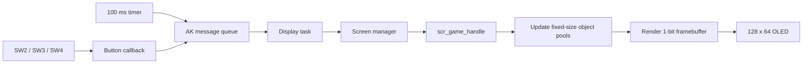

<div align="center">

# Bug_Storm Getting Started Guide

**Build, flash and begin developing the 1-bit STM32 game**

</div>

## Table of contents

1. [Project overview](#1-project-overview)
2. [Hardware target](#2-hardware-target)
3. [Firmware and flash layout](#3-firmware-and-flash-layout)
4. [Repository structure](#4-repository-structure)
5. [Prepare Kali Linux](#5-prepare-kali-linux)
6. [Build the application](#6-build-the-application)
7. [Build the bootloader](#7-build-the-bootloader)
8. [Flash and run](#8-flash-and-run)
9. [First gameplay test](#9-first-gameplay-test)
10. [Where to read the code](#10-where-to-read-the-code)
11. [Framebuffer-to-image workflow](#11-framebuffer-to-image-workflow)
12. [Troubleshooting](#12-troubleshooting)

## 1. Project overview

Bug_Storm is a vertical 1-bit shooter for the AK Embedded Base Kit. The player
moves a ship horizontally, fires automatically, destroys an 18-Bug formation,
collects square power gifts and fights a Boss at the end of every wave.

The application is event driven. Physical buttons and software timers create AK
messages; the display task dispatches those messages to the active screen. The
game has no blocking gameplay loop.



## 2. Hardware target

| Component | Project target |
|---|---|
| MCU | STM32L151CBT6, ARM Cortex-M3 |
| Flash | 128 KB |
| RAM | 16 KB |
| Display | 128 × 64 monochrome OLED |
| Input | SW2, SW3 and SW4/MODE |
| Feedback | OLED and buzzer |
| Build output | ARM bare-metal `.bin` firmware |

The renderer uses a logical drawing area of 124 × 60 px inside the OLED frame.
Coordinates start at the upper-left corner; X grows right and Y grows down.

## 3. Firmware and flash layout

| Region | Start | End | Size | Purpose |
|---|---:|---:|---:|---|
| Bootloader | `0x08000000` | `0x08001FFF` | 8 KB | Board boot and update support. |
| Shared/config | `0x08002000` | `0x08002FFF` | 4 KB | Reserved shared region. |
| Bug_Storm application | `0x08003000` | `0x0801FFFF` | 116 KB | Game firmware. |

The application binary must be written at `0x08003000`. Flashing it at the MCU
base address can overwrite the bootloader.

## 4. Repository structure

```text
Bug_Storm/
├── application/
│   ├── Makefile
│   ├── sources/app/screens/
│   │   ├── scr_startup.cpp       Startup logo and menu
│   │   ├── scr_game.cpp          Complete Bug_Storm gameplay
│   │   └── scr_mng.cpp           Screen dispatch and render scheduling
│   └── sources/app/task/
│       └── task_display.cpp      Display-task message receiver
├── boot/                         AK bootloader firmware
├── docs/                         Design and runtime documentation
├── hardware/                     Board resources
├── resources/images/             README presentation assets
├── tools/framebuffer_to_png.py    Exact framebuffer conversion tool
└── README.md
```

## 5. Prepare Kali Linux

Install the ARM toolchain and build utilities:

```bash
sudo apt update
sudo apt install -y \
  build-essential make \
  gcc-arm-none-eabi binutils-arm-none-eabi \
  libnewlib-arm-none-eabi libstdc++-arm-none-eabi-newlib
```

Confirm that the commands are available:

```bash
arm-none-eabi-gcc --version
arm-none-eabi-g++ --version
make --version
```

Check free disk space before copying or building:

```bash
df -h /
du -xhd1 ~ 2>/dev/null | sort -hr | head -20
```

## 6. Build the application

```bash
cd ~/Bug_Storm/application
make clean
make -j"$(nproc)"
```

Expected output:

```text
application/build_bug-storm/
├── bug-storm.axf
├── bug-storm.bin               File used for flashing
├── bug-storm.elf
├── bug-storm.map               Linker map and memory inspection
└── bug-storm.out
```

Verify the image and its size:

```bash
ls -lh build_bug-storm/bug-storm.bin
arm-none-eabi-size build_bug-storm/bug-storm.elf
```

## 7. Build the bootloader

Only rebuild or flash the bootloader when board setup requires it. Normal game
updates need only the application image.

```bash
cd ~/Bug_Storm/boot
make clean
make -j"$(nproc)"
```

Expected boot image:

```text
boot/build_ak-base-kit-stm32l151-boot/
└── ak-base-kit-stm32l151-boot.bin
```

## 8. Flash and run

Connect the board and find the serial device:

```bash
ls -l /dev/ttyUSB* /dev/ttyACM* 2>/dev/null
```

Using the project Makefile/AK bootloader path:

```bash
cd ~/Bug_Storm/application
make flash dev=/dev/ttyUSB0
```

Equivalent explicit application write, when `ak-flash` is installed:

```bash
ak-flash /dev/ttyUSB0 build_bug-storm/bug-storm.bin 0x08003000
```

If the device is permission denied:

```bash
sudo usermod -aG dialout "$USER"
```

Log out and sign in again before retrying. Do not use `sudo make` because it can
leave root-owned build files in the source tree.

## 9. First gameplay test

1. Reset the board and wait for the startup screen.
2. Select `Bug_Storm` and press MODE.
3. Confirm that Wave 1 creates a centered 6 × 3 Bug formation.
4. Press RIGHT: the ship must move right by 5 px.
5. Press LEFT: the ship must move left by 5 px.
6. Confirm that bullets fire automatically.
7. Destroy all 18 Bugs and confirm the Boss appears.
8. Collect square gifts and verify `P` increases only to 4.
9. Lose all three lives and press any short button to restart.
10. Hold MODE and confirm the game returns to the startup menu.

## 10. Where to read the code

| Goal | File / symbol |
|---|---|
| Startup menu | `scr_startup.cpp`, `scr_startup_handle()` |
| Game entry and buttons | `scr_game.cpp`, `scr_game_handle()` |
| Game initialization | `game_init()`, `game_start_wave()` |
| Automatic fire | `game_update()`, `game_fire()` |
| Formation and Boss | `game_update_formation()`, `game_start_boss()`, `game_update_boss()` |
| Object collision | `game_update_projectiles()`, `boxes_overlap()` |
| Player damage | `game_player_hit()` |
| 1-bit drawing | `draw_ship()`, `draw_bug()`, `draw_boss()`, `view_scr_game()` |

Continue with [Game Object Design and Sequences](02-design-sequence-object.md),
then [Runtime Signal and Game Sequences](03-design-sequence-runtime.md).

## 11. Framebuffer-to-image workflow

The source draws the objects with OLED primitives rather than standalone image
files. To capture the exact firmware frame, dump the 1024-byte OLED framebuffer
with the firmware command `lcd d`, save it as a binary or accepted dump format,
then run:

```bash
python3 tools/framebuffer_to_png.py framebuffer.bin frame.png
```

Use the generated PNG in documentation when an exact game screenshot is needed.
Do not redraw the game objects by eye because that can differ from the firmware.

## 12. Troubleshooting

| Symptom | Cause / check |
|---|---|
| `arm-none-eabi-gcc: command not found` | Install `gcc-arm-none-eabi` and open a new shell. |
| Toolchain library version path fails | Query paths with `arm-none-eabi-gcc -print-file-name=libc.a` and `-print-libgcc-file-name`. |
| No `.bin` appears | Fix the first compiler/linker error, then run `make clean`. |
| Board boots old game | Confirm the new `bug-storm.bin` was written at `0x08003000`. |
| `/dev/ttyUSB0` is denied | Add the user to `dialout`, then sign in again. |
| `scp` reports `Failure` | Check `df -h /`; a full Linux root filesystem prevents remote writes. |
| Movement labels differ from code signals | Player controls are LEFT/RIGHT; the framework retains the internal signal names `BUTON_DOWN`/`BUTON_UP`. |
| Mermaid is not visible locally | View the Markdown on GitHub or in a Mermaid-capable preview. |
