<div align="center">

# Bug_Storm Game Object Design and Sequences

**Object ownership, state, update, collision and rendering based on the firmware**

</div>

## Table of contents

1. [Object model](#1-object-model)
2. [Memory ownership](#2-memory-ownership)
3. [Player Ship](#3-player-ship)
4. [Player Bullet](#4-player-bullet)
5. [Bug Formation](#5-bug-formation)
6. [Enemy Egg](#6-enemy-egg)
7. [Power Gift](#7-power-gift)
8. [Boss](#8-boss)
9. [Collision matrix](#9-collision-matrix)
10. [Phase transitions](#10-phase-transitions)
11. [Rendering source](#11-rendering-source)

## 1. Object model

All gameplay objects are owned by the game screen and are updated from the same
100 ms game-tick signal. No object owns a thread and no object allocates memory
at runtime.

| Object | Maximum | Representation | Main responsibility |
|---|---:|---|---|
| Player Ship | 1 | Position and counters | Movement, lives and firepower origin. |
| Player Bullet | 20 | `projectile_t` pool | Travel upward and damage Bug/Boss. |
| Bug | 18 | `bool bugs[18]` plus formation origin | Formation movement and egg source. |
| Enemy Egg | 5 | `projectile_t` pool | Fall toward and damage the Ship. |
| Power Gift | 3 | `projectile_t` pool | Raise shot level or award bonus score. |
| Boss | 1 | Position, direction and HP state | End-of-wave enemy. |

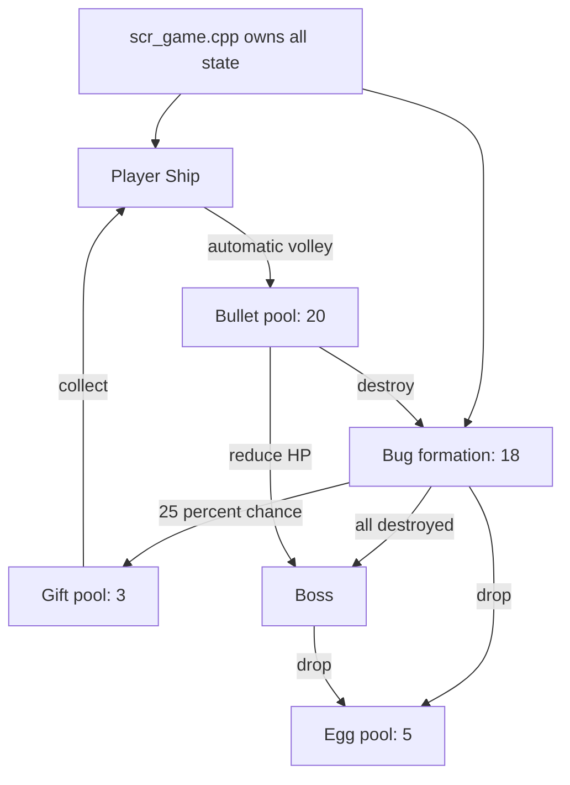

## 2. Memory ownership

The pools are static in `scr_game.cpp`:

```cpp
static bool bugs[BUG_COUNT];
static projectile_t player_bullets[MAX_PLAYER_BULLETS];
static projectile_t eggs[MAX_EGGS];
static projectile_t gifts[MAX_GIFTS];
```

Each projectile slot contains `x`, `y` and `active`. A spawn function scans for
an inactive slot; if the pool is full, the spawn is skipped. `clear_projectiles()`
deactivates bullets, eggs and gifts when the game changes phase or the player is
hit.

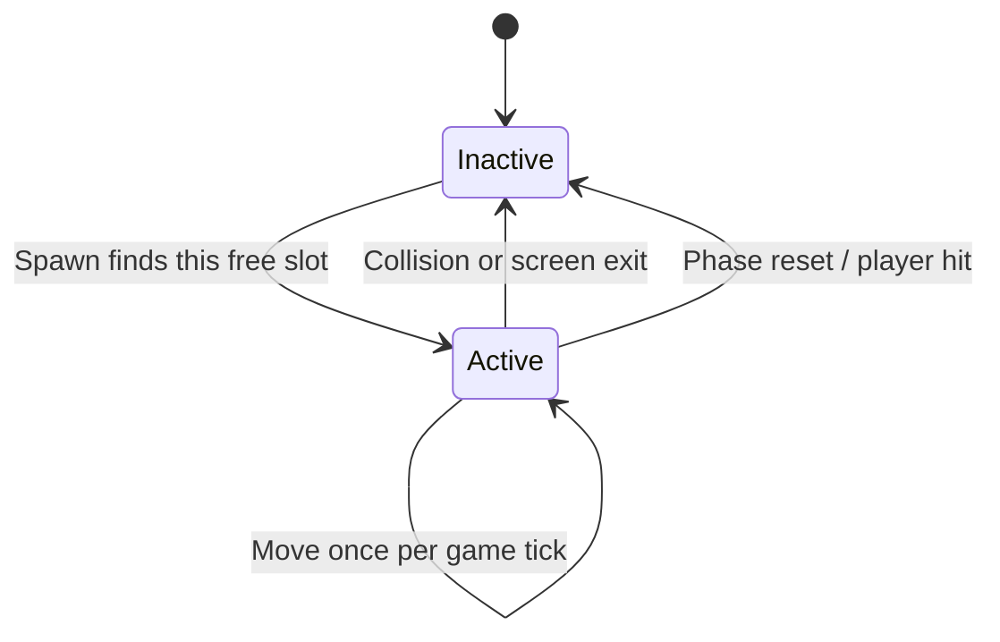

## 3. Player Ship

### 3.1 Constants and state

| Item | Code value |
|---|---:|
| Sprite boundary | 11 × 7 px |
| Fixed Y | 52 px |
| Movement step | 5 px per button press |
| Initial lives | 3 |
| Initial shot level | 1 |
| Maximum shot level | 4 |
| Invulnerability after damage | 12 ticks ≈ 1.2 s |

The Ship state is `player_x`, `lives`, `shot_level`, `fire_cooldown` and
`invulnerable_ticks`. X is clamped so the 11-pixel-wide Ship never leaves the
logical display.

### 3.2 Input-to-movement sequence

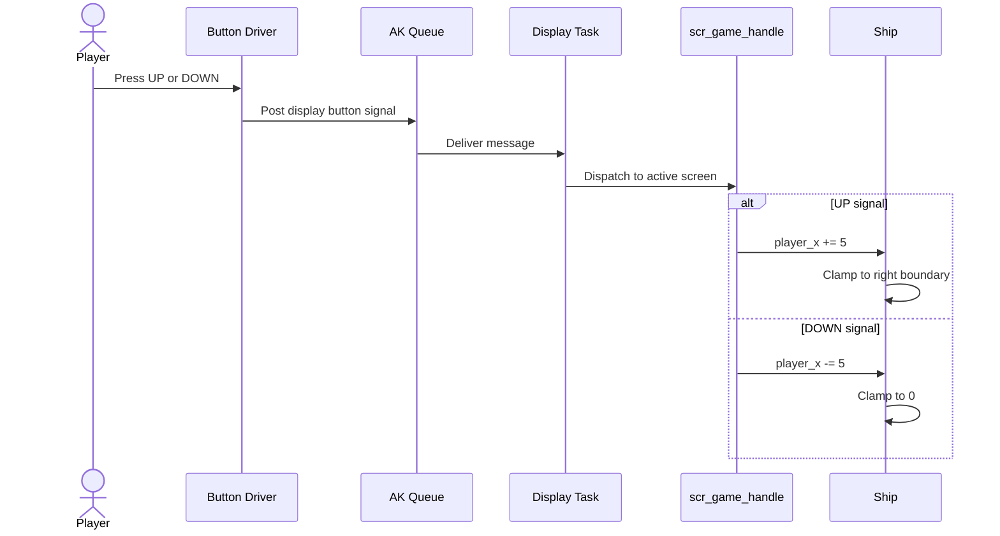

### 3.3 Damage sequence

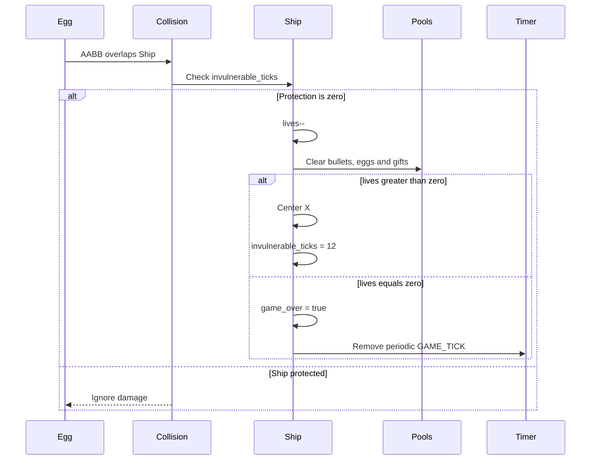

While invulnerable, the render function blinks the Ship instead of changing its
collision size.

## 4. Player Bullet

### 4.1 Automatic firing

`game_update()` decreases `fire_cooldown`. When it reaches zero,
`game_fire()` creates a volley and reloads the cooldown to 2 ticks (about 200 ms).
MODE short press can also call `game_fire()` while the game is active, but the
normal firing mechanism is automatic.

| `shot_level` | Horizontal offsets from Ship center |
|---:|---|
| 1 | `0` |
| 2 | `-3`, `+3` |
| 3 | `-5`, `0`, `+5` |
| 4 | `-6`, `-2`, `+2`, `+6` |

### 4.2 Lifecycle

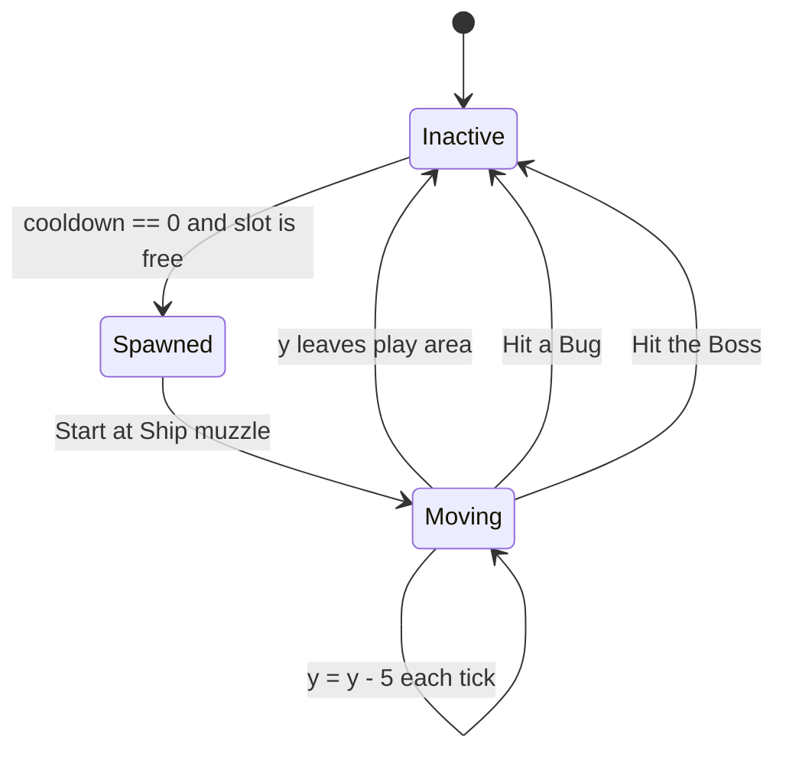

### 4.3 Damage and scoring

```mermaid
sequenceDiagram
    participant Tick
    participant Bullet
    participant Target as Bug or Boss
    participant Score
    participant Gift

    Tick->>Bullet: Move upward 5 px
    Bullet->>Target: AABB test
    alt Bug hit
        Target->>Target: bugs[index] = false; bugs_left--
        Target->>Score: Add 10 × wave
        Target->>Gift: 25 percent spawn attempt
    else Boss hit
        Target->>Target: boss_hp--
        Target->>Score: Add 5 × wave
        opt HP reaches zero
            Target->>Score: Add 100 × wave Boss bonus
        end
    end
    Target->>Bullet: active = false
```

## 5. Bug Formation

### 5.1 Layout

| Property | Value |
|---|---:|
| Rows × columns | 3 × 6 |
| Total Bugs | 18 |
| Bug boundary | 10 × 7 px |
| Column step | 16 px |
| Row step | 10 px |
| Initial formation origin | X = 14, Y = 11 |
| Initial direction | Right |

Only each Bug's alive/dead flag is stored. Its current position is calculated by
`bug_x(index)` and `bug_y(index)` from the shared formation origin.

```text
index:  0  1  2  3  4  5
        6  7  8  9 10 11
       12 13 14 15 16 17
```

### 5.2 Formation update

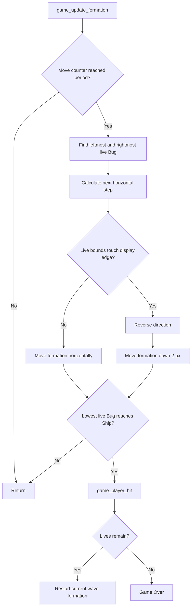

Difficulty increases using a shorter move period and a larger step, bounded so
the period never becomes zero.

### 5.3 Egg source selection

For the formation phase, the code chooses a column and searches upward from the
bottom row. Therefore only the lowest living Bug in that column can release an
Egg; a dead front Bug does not block Bugs behind it.

## 6. Enemy Egg

| Property | Value / rule |
|---|---|
| Pool capacity | 5 |
| Drawn shape | Circle radius 1 plus a lower pixel |
| Formation origin | Lowest living Bug in selected column |
| Boss origin | Random X beneath the Boss body |
| Vertical speed | `2 + wave / 4` px per tick |
| Hit result | One life lost if Ship is not invulnerable |

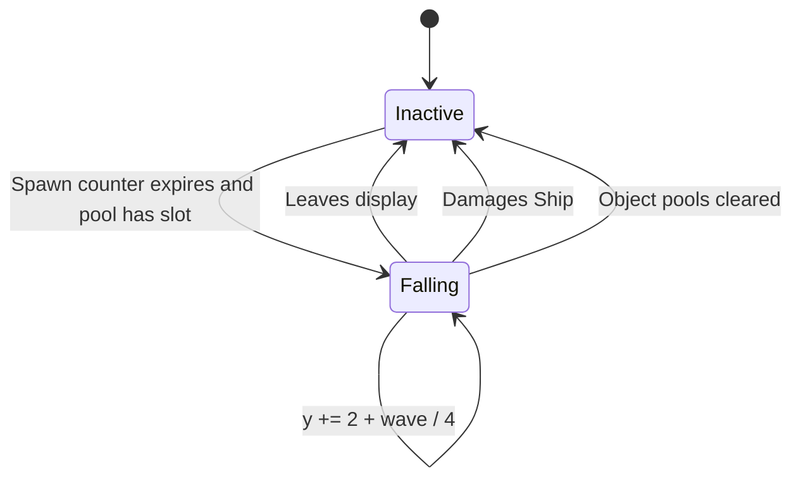

## 7. Power Gift

A destroyed Bug attempts `rand() % 4`; result zero means a 25% gift chance. A
gift is a 5 × 5 px outlined square and falls 2 px per tick. At most three may be
active.

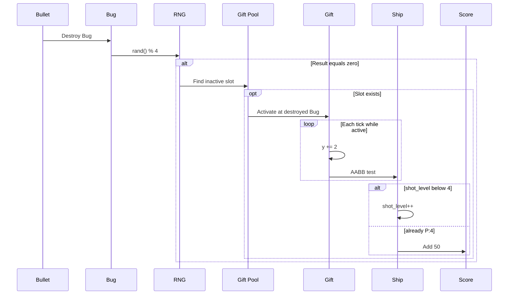

## 8. Boss

### 8.1 Properties

| Property | Firmware rule |
|---|---|
| Boundary | 30 × 18 px |
| Initial X | `(LCD_WIDTH - 30) / 2` |
| Initial Y | 15 px |
| Maximum HP | `10 + wave × 5` |
| Move period | `max(1, 2 - wave / 4)` ticks |
| Move step | `1 + wave / 4` px |
| Bullet hit score | `5 × wave` |
| Defeat bonus | `100 × wave` |
| Egg counter at entry | 5 |

The Boss is never part of the initial formation. `game_start_boss()` runs only
after `bugs_left == 0`, centers the Boss, initializes scaled HP and clears every
projectile/gift slot from the previous phase.

### 8.2 Boss lifecycle

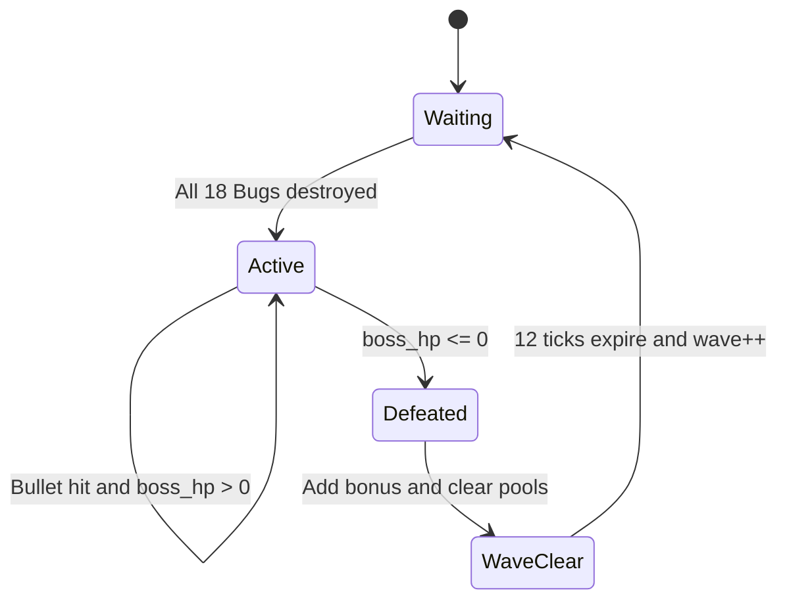

### 8.3 Boss fight

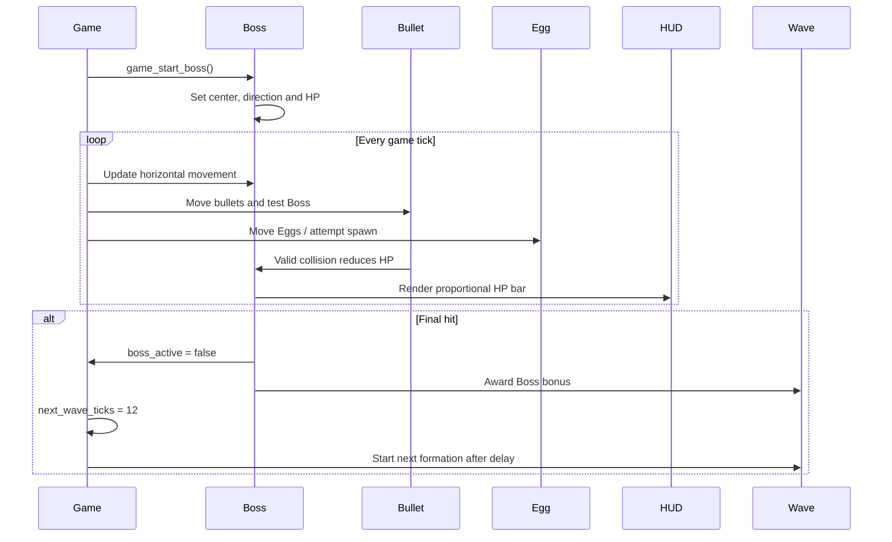

## 9. Collision matrix

All collisions use `boxes_overlap()`, an axis-aligned bounding-box test.

| Source | Target | Test size | Result |
|---|---|---|---|
| Player Bullet | Bug | Bullet 2×4, Bug 10×7 | Remove both; score; possible Gift. |
| Player Bullet | Boss | Bullet 2×4, Boss 30×18 | Remove Bullet; HP−1; score. |
| Egg | Ship | Egg 3×4, Ship 11×7 | Remove Egg; damage if vulnerable. |
| Gift | Ship | Gift 5×5, Ship 11×7 | Remove Gift; P+1 or +50 score. |

Collision priority is Boss hit when `boss_active`, otherwise Bug hit, followed by
Gift collection and Egg damage. Once a projectile is deactivated, later checks
in that tick must ignore it.

## 10. Phase transitions

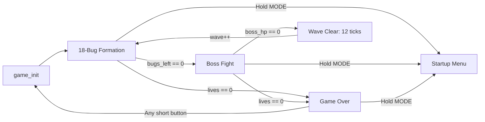

## 11. Rendering source

The gameplay objects are generated from drawing primitives in the source, not
from independent PNG files or C bitmap byte arrays:

| Visual | Function / primitive |
|---|---|
| Ship | `draw_ship()` using lines and filled rectangles |
| Bug | `draw_bug()` using filled rectangles, pixels and lines |
| Boss | `draw_boss()` using rounded rectangles, pixels and lines |
| Bullet | 2 × 4 filled rectangle in `view_scr_game()` |
| Egg | circle plus pixel in `view_scr_game()` |
| Gift | 5 × 5 rectangle plus center pixel in `view_scr_game()` |
| HUD / HP bar | Text, horizontal lines and rectangles in `view_scr_game()` |

For an exact documentation image, capture the real 1-bit framebuffer and use
`tools/framebuffer_to_png.py`. This keeps the documentation synchronized with the
firmware drawing code.
