<div align="center">

# Bug_Storm Runtime Signal and Game Sequences

**From physical button and timer event to gameplay update, render and End Game**

</div>

## Table of contents

1. [Runtime participants](#1-runtime-participants)
2. [Startup and screen entry](#2-startup-and-screen-entry)
3. [Button event thread](#3-button-event-thread)
4. [Periodic game thread](#4-periodic-game-thread)
5. [Complete game state machine](#5-complete-game-state-machine)
6. [Formation phase](#6-formation-phase)
7. [Boss phase](#7-boss-phase)
8. [Player hit and Game Over](#8-player-hit-and-game-over)
9. [Restart and exit](#9-restart-and-exit)
10. [Render thread](#10-render-thread)
11. [Timing table](#11-timing-table)
12. [Runtime invariants](#12-runtime-invariants)

## 1. Runtime participants

| Participant | Role |
|---|---|
| Player | Presses SW2/SW3/SW4. |
| Hardware timer ISR | Polls and debounces physical buttons. |
| Button callback | Converts the driver state to an AK signal. |
| AK message queue | Transfers button and timer events to the display task. |
| Display task | Receives messages and calls the screen manager. |
| Screen manager | Dispatches to the active screen and schedules rendering. |
| Startup screen | Displays logo/menu and enters Bug_Storm. |
| Game screen | Owns all game state and handles every game signal. |
| AK timer | Posts `AC_DISPLAY_GAME_TICK` every 100 ms. |
| OLED renderer | Produces and transfers the 1-bit framebuffer. |
| Buzzer | Plays transition/feedback sounds requested by screens. |

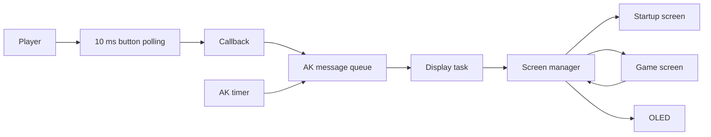

## 2. Startup and screen entry

The startup screen shows `Bug_Storm`, `Cai dat` and `Thong ke`. UP/DOWN change
the highlighted menu item. MODE enters the selected screen; selecting Bug_Storm
transitions to `scr_game`.

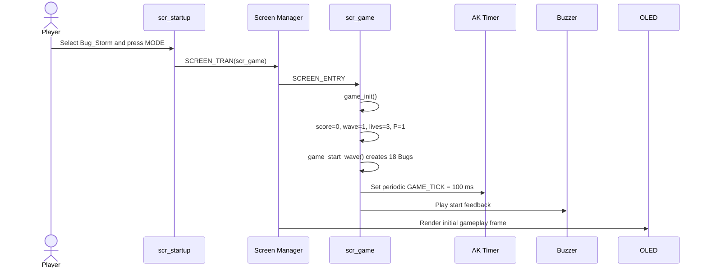

Initialization values:

| State | Value |
|---|---:|
| Ship X | Horizontally centered |
| Score | 0 |
| Wave | 1 |
| Lives | 3 |
| Shot level | 1 |
| Bugs alive | 18 |
| Boss active | false |
| Game Over | false |

## 3. Button event thread

The physical-button path never changes gameplay state inside an interrupt. The
callback posts a signal; state changes occur later in display-task context.

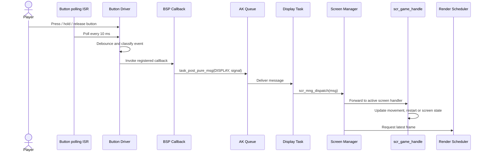

### Button mapping in the game screen

| Physical event | AK signal | Active-game action | Game-Over action |
|---|---|---|---|
| UP pressed | `AC_DISPLAY_BUTON_UP_PRESSED` | Move Ship right 5 px | Restart game |
| DOWN pressed | `AC_DISPLAY_BUTON_DOWN_PRESSED` | Move Ship left 5 px | Restart game |
| MODE pressed | `AC_DISPLAY_BUTON_MODE_PRESSED` | Request fire; automatic fire remains active | Restart game |
| MODE held | `AC_DISPLAY_BUTON_MODE_LONG_PRESSED` | Stop tick and return to startup | Return to startup |

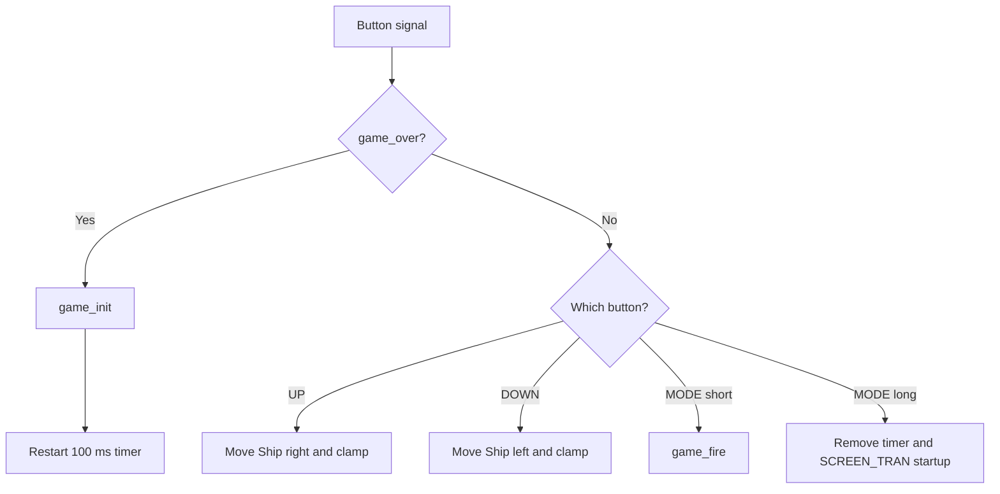

## 4. Periodic game thread

The AK timer posts `AC_DISPLAY_GAME_TICK` every 100 ms while the game is active.
One message advances the simulation exactly once.

```mermaid
sequenceDiagram
    participant Timer as AK Timer
    participant Queue as AK Queue
    participant Display as Display Task
    participant Manager as Screen Manager
    participant Game as scr_game_handle
    participant Enemy as Formation / Boss
    participant Pools as Bullets / Eggs / Gifts
    participant Collision
    participant Render

    loop Every 100 ms
        Timer->>Queue: AC_DISPLAY_GAME_TICK
        Queue->>Display: Deliver signal
        Display->>Manager: Dispatch
        Manager->>Game: scr_game_handle(GAME_TICK)
        alt game_over is false
            Game->>Game: game_update()
            Game->>Game: Update animation and counters
            opt Fire cooldown reaches zero
                Game->>Pools: Create automatic Bullet volley
            end
            alt Wave-clear delay active
                Game->>Game: next_wave_ticks--
                opt Delay reaches zero
                    Game->>Game: wave++; game_start_wave()
                end
            else Boss active
                Game->>Enemy: game_update_boss()
            else Formation active
                Game->>Enemy: game_update_formation()
            end
            Game->>Pools: game_update_projectiles()
            Pools->>Collision: Resolve hit tests
            Collision-->>Game: Score, HP, lives and active flags
            Game->>Pools: Attempt enemy Egg spawn
            Game->>Game: Check Formation-to-Boss transition
        end
        Manager->>Render: Render updated state
    end
```

The order matters: cooldown/phase update occurs before projectile collision and
phase-transition checking. Render functions read state after the update and do
not modify gameplay.

## 5. Complete game state machine

```mermaid
stateDiagram-v2
    [*] --> Startup
    Startup --> Initializing: MODE on Bug_Storm
    Initializing --> Formation: Wave 1 initialized

    state Formation {
        [*] --> BugsMoving
        BugsMoving --> BugsMoving: Bugs remain
        BugsMoving --> PlayerHit: Egg collision or invasion
        PlayerHit --> BugsMoving: Lives remain
        BugsMoving --> FormationClear: bugs_left == 0
    }

    FormationClear --> BossEntering: game_start_boss()

    state BossFight {
        [*] --> BossMoving
        BossMoving --> BossMoving: boss_hp > 0
        BossMoving --> PlayerHitBoss: Egg collision
        PlayerHitBoss --> BossMoving: Lives remain
        BossMoving --> BossDefeated: boss_hp <= 0
    }

    BossEntering --> BossFight
    BossDefeated --> WaveClear
    WaveClear --> Formation: 12 ticks; wave++
    PlayerHit --> GameOver: lives == 0
    PlayerHitBoss --> GameOver: lives == 0
    GameOver --> Initializing: Any short button
    Formation --> Startup: Hold MODE
    BossFight --> Startup: Hold MODE
    GameOver --> Startup: Hold MODE
```

## 6. Formation phase

### Normal formation tick

```mermaid
sequenceDiagram
    participant Tick
    participant Formation
    participant Bullet
    participant Bug
    participant Gift
    participant Egg
    participant Ship
    participant Game

    Tick->>Formation: Update counter and movement if due
    Formation->>Formation: Reverse and descend at edge
    Formation->>Ship: Check invasion boundary
    Tick->>Bullet: Move active Bullets upward
    Bullet->>Bug: Test every live Bug
    alt Valid hit
        Bug->>Bug: Set inactive; bugs_left--
        Bug->>Game: Add 10 × wave
        Bug->>Gift: 25 percent spawn attempt
    end
    Tick->>Gift: Fall and test Ship
    Tick->>Egg: Fall and test Ship
    Tick->>Game: Spawn Egg when counter expires
    alt bugs_left becomes zero
        Game->>Game: game_start_boss()
    end
```

### Formation-to-Boss transition

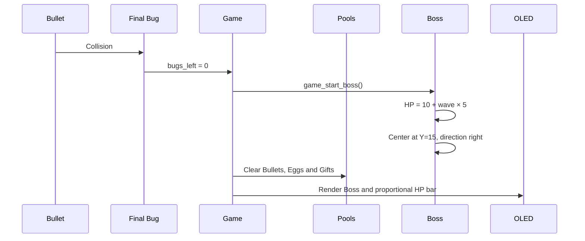

## 7. Boss phase

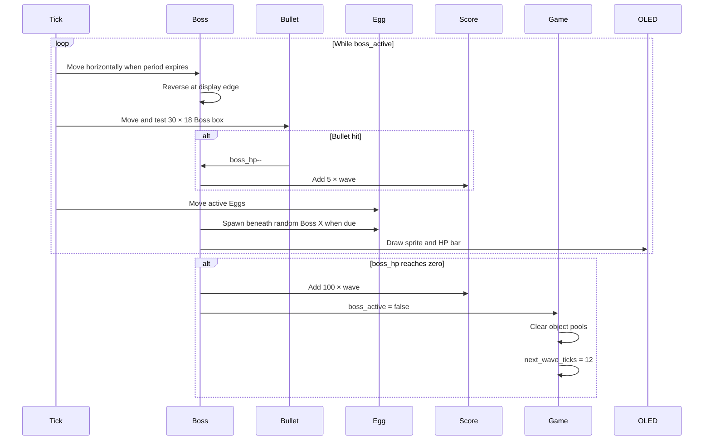

### Boss-to-next-wave transition

```mermaid
sequenceDiagram
    participant Timer
    participant Game
    participant HUD
    participant Formation

    Game->>Game: Boss defeated; next_wave_ticks = 12
    Game->>HUD: Show WAVE CLEAR state
    loop 12 GAME_TICK messages
        Timer->>Game: AC_DISPLAY_GAME_TICK
        Game->>Game: next_wave_ticks--
    end
    Game->>Game: wave++
    Game->>Formation: game_start_wave()
    Formation->>Formation: Activate all 18 Bugs
```

## 8. Player hit and Game Over

Both an Egg collision and a formation reaching the Ship call
`game_player_hit()`.

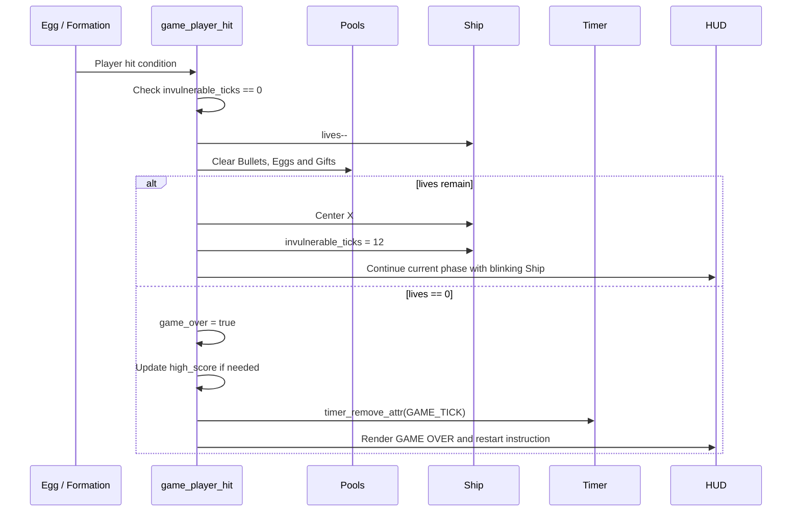

`high_score` is a single in-memory best score for the running firmware session;
the current code does not implement a multi-row persistent ranking database.

## 9. Restart and exit

### Restart after Game Over

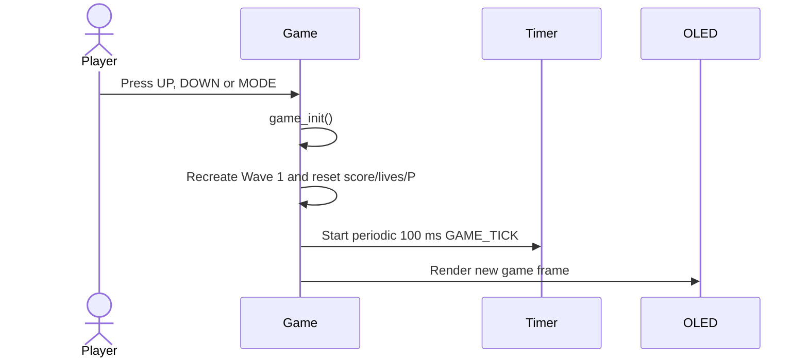

### Exit to startup

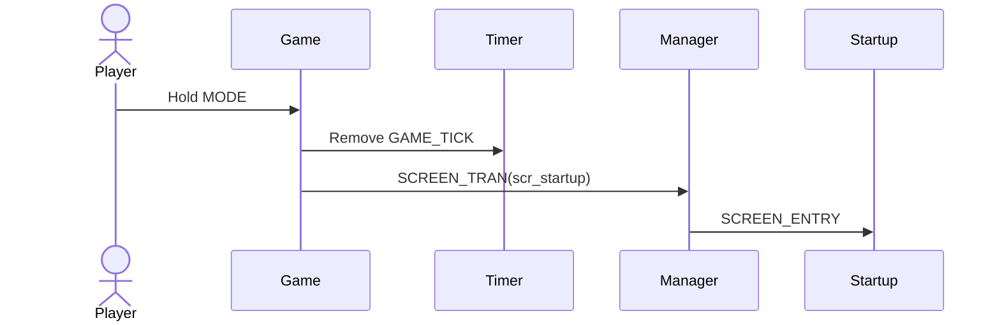

## 10. Render thread

The screen manager limits OLED updates to approximately one frame per 50 ms.
Because game state changes at 100 ms, a button signal may request an intermediate
render without advancing simulation time.

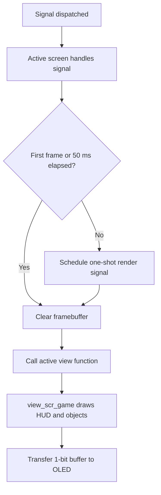

The gameplay frame is drawn in this conceptual order:

1. HUD values: score, wave, firepower and lives.
2. HUD separator and Boss HP bar when active.
3. Boss or the remaining Bug formation.
4. Active Bullets, Eggs and Gifts.
5. Ship, with invulnerability blinking.
6. Wave Clear or Game Over overlay when applicable.

## 11. Timing table

| Event | Firmware timing |
|---|---:|
| Button polling | 10 ms |
| Game update tick | 100 ms |
| Render limiter | 50 ms |
| Automatic-fire cooldown | 2 ticks ≈ 200 ms |
| Player invulnerability | 12 ticks ≈ 1.2 s |
| Wave-clear delay | 12 ticks ≈ 1.2 s |
| Bullet travel | 5 px per game tick |
| Gift fall | 2 px per game tick |
| Egg fall | `2 + wave / 4` px per game tick |

All gameplay delays are counters. No screen handler blocks with `sleep` or a
busy-wait.

## 12. Runtime invariants

- Exactly one enemy phase is active: Formation or Boss.
- Boss entry requires `bugs_left == 0`.
- A new wave requires Boss HP zero and the 12-tick clear delay completed.
- `shot_level` remains in the range 1..4.
- Player X remains within the logical display boundary.
- Inactive pool slots are ignored by update, collision and rendering.
- The periodic game timer is absent during Game Over and after leaving the game.
- The button callback posts messages; it does not directly edit game state.
- A full projectile pool causes a skipped spawn, never an out-of-bounds write.
